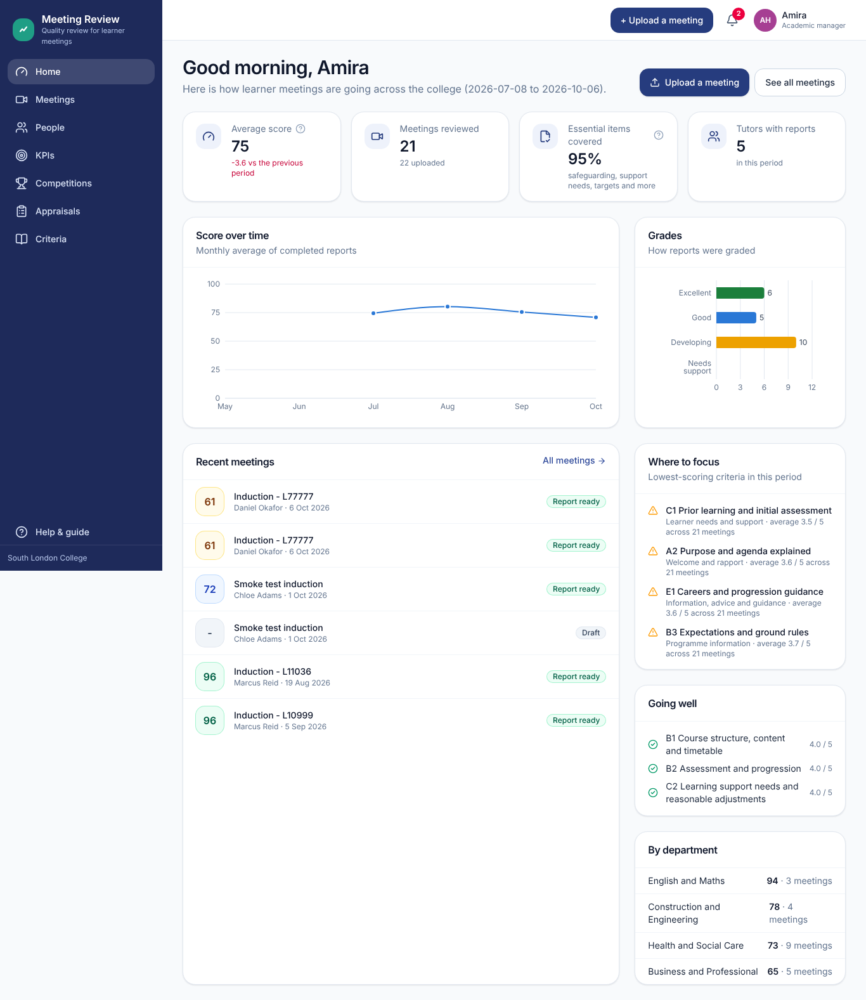
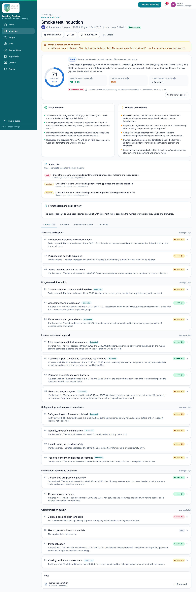
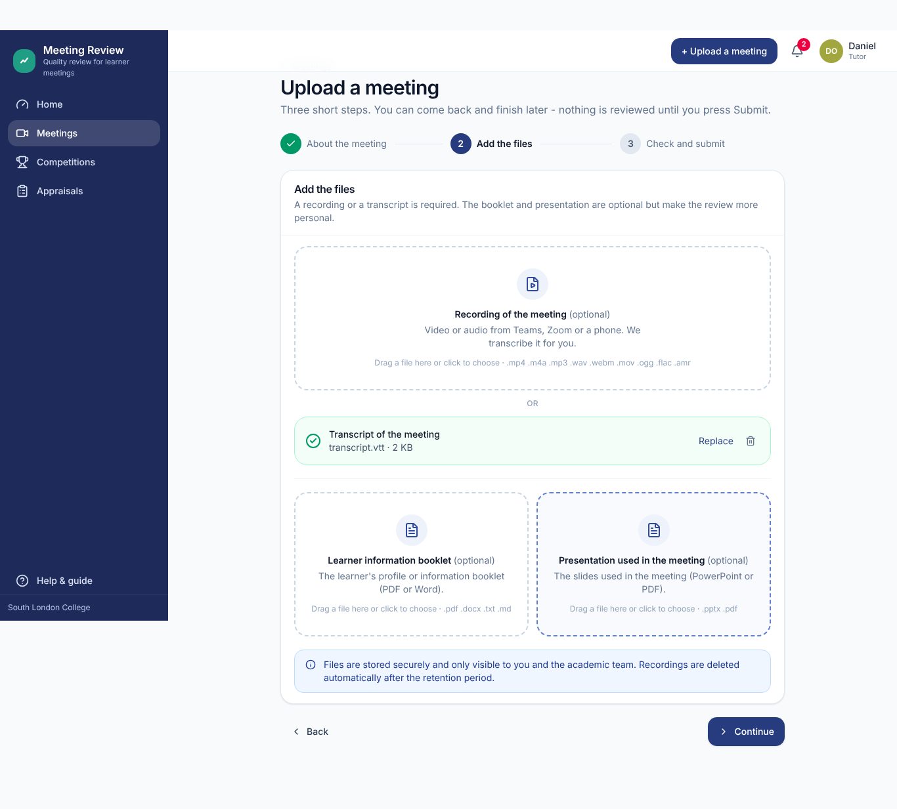
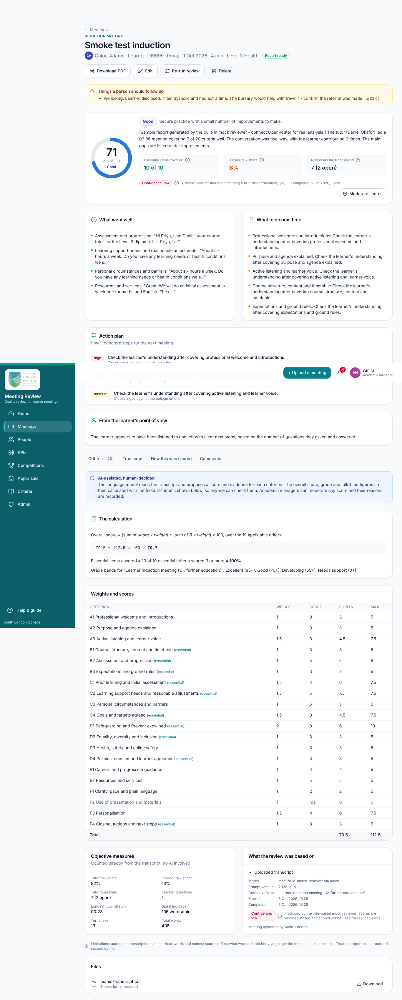
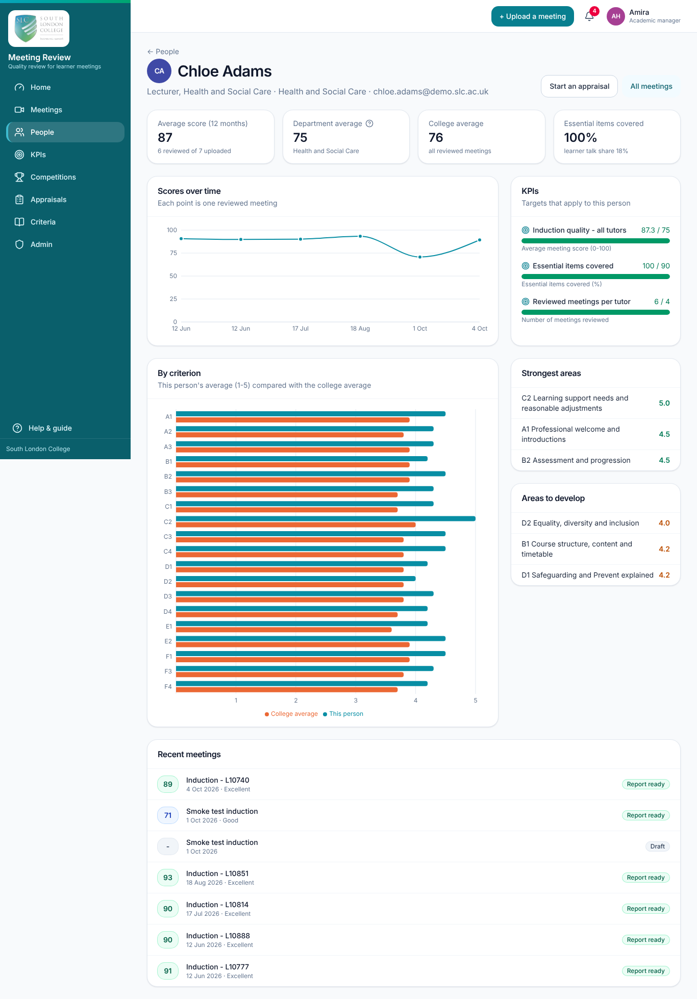
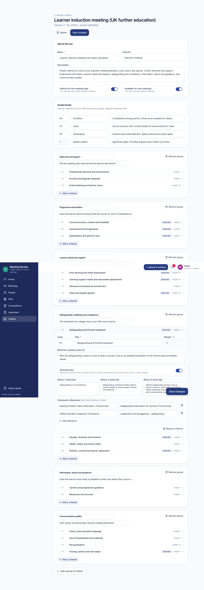

# Meeting Review

AI-assisted quality review of tutor-learner meetings for South London College.

Staff upload a recording or transcript of a meeting (for example an induction meeting), optionally the learner information booklet and the presentation used. The system transcribes the recording, reads the documents, and reviews **the tutor's conduct of the meeting** against the college's criteria. Every score comes with evidence quotes and a plain-English rationale, the arithmetic is shown in full, managers can moderate, and progress feeds dashboards, KPIs, competitions and appraisal summaries.

> AI-assisted, human-decided. Reports are structured evidence for a professional conversation, never an automatic verdict. See [docs/data-protection.md](docs/data-protection.md).

## What is in the box

| Area | Highlights |
|---|---|
| Upload | Three-step wizard; drag-and-drop; direct-to-storage uploads with progress; Teams `.vtt`/`.docx`, `.srt`, `.txt`, or audio/video (transcribed by Amazon Transcribe) |
| Review | Configurable criteria sets (preset induction rubric mapped to Ofsted EIF, ETF Professional Standards, Matrix Standard, KCSIE/Prevent, Equality Act, UK GDPR, DfE funding rules); 1-5 scores with descriptors, weights and "essential" items; evidence quotes with timestamps; strengths, improvements, action plan, risks for follow-up, learner-experience note, confidence level |
| Transparency | "How this was scored" tab with the exact calculation; objective talk-time and question metrics computed from the transcript; model, prompt and criteria versions recorded; full audit log |
| People | Role-based access for tutors, academic admins, academic managers, HR, directors and system admins; profiles; person pages with trends and criterion comparison against department and college averages |
| Performance | Moderation with reasons; comments; KPIs (average score, essential coverage, meetings reviewed, learner talk share) by college, department or person; competitions with standings; appraisal summaries generated from statistics, shared with the tutor for a response; CSV export |
| Operations | Separate deployable frontend (static SPA) and backend (Docker container); PostgreSQL-backed job queue (no Redis); mock providers for zero-cost local demos; Terraform for AWS (eu-west-2); GitHub Actions CI/CD; retention sweeps; notifications in-app and by email |

## Screenshots

| | |
|---|---|
|  |  |
| Home dashboard for an academic manager | A meeting report with evidence-backed criteria |
|  |  |
| Step 2 of the upload wizard | The transparent calculation behind every score |
|  |  |
| A tutor's progress against department and college averages | Editing a criteria set |

More in [docs/screenshots](docs/screenshots) (KPIs, competitions, appraisals, processing status, mobile).

## Repository layout

```
apps/web              React + Vite + Tailwind single-page app (deploys to S3 + CloudFront, or any static host)
apps/api              Node 22 + Fastify + Prisma API and background worker (deploys as a Docker container to ECS Fargate, or anywhere)
packages/shared       Types, Zod schemas, role/permission matrix, scoring engine and the preset rubric - shared by both apps
infra/docker-compose.yml   Local stack: Postgres + MinIO + API + web
infra/terraform       AWS infrastructure (VPC, RDS, S3, CloudFront, ALB, ECS, ECR, Secrets Manager, SES, GitHub OIDC)
.github/workflows     CI (typecheck, tests, builds) and separate deploy pipelines for web and API
docs/                 Architecture, API reference, user guide, criteria & benchmarks, data protection, AWS deployment
```

## Quick start (local, no cloud accounts needed)

Prerequisites: Node 22, pnpm 10 (`corepack enable`), PostgreSQL 16 (local install or Docker).

```bash
pnpm install
cp apps/api/.env.example apps/api/.env       # defaults use local file storage and mock AI/transcription providers
# edit DATABASE_URL in apps/api/.env if your Postgres is not postgres:postgres@localhost:5432/meeting_review
pnpm --filter @slc/shared build
pnpm --filter @slc/api exec prisma migrate deploy
pnpm db:seed                                 # first admin + preset criteria + demo tutors, meetings and reports
pnpm dev                                     # API on http://localhost:4000, web on http://localhost:5173
```

Sign in at http://localhost:5173 with one of the demo accounts printed by the seed (for example `amira.hassan@demo.slc.ac.uk` / `Demo-Pass-2026` as academic manager, or the system admin from `SEED_ADMIN_EMAIL`/`SEED_ADMIN_PASSWORD`). Upload a transcript and watch the report appear. With the mock providers, reports are generated by a rule-based reviewer and clearly labelled as samples.

Alternatively run the whole stack with Docker:

```bash
cd infra && docker compose up --build        # web on http://localhost:8080
```

### Switching on the real services

In `apps/api/.env` (or the ECS task definition):

```
STORAGE_PROVIDER=s3            S3_BUCKET=...  S3_REGION=eu-west-2
TRANSCRIPTION_PROVIDER=aws     TRANSCRIBE_LANGUAGE=en-GB
LLM_PROVIDER=openrouter        OPENROUTER_API_KEY=...  OPENROUTER_MODEL=anthropic/claude-sonnet-5.5
EMAIL_PROVIDER=ses             EMAIL_FROM="Meeting Review <no-reply@yourcollege.ac.uk>"
```

Any chat model listed on OpenRouter can be used; the model name is also editable in Admin → Settings. Pick a current, high-quality model and record the choice in your DPIA (data goes to that model's provider).

## Deploying to AWS

Two deployment profiles are provided. Both serve the web app from S3 + CloudFront and keep the API on the same domain (CloudFront routes `/api/*` to the backend), so there is no cross-site cookie configuration.

| Profile | Backend | Fixed monthly hosting cost | When to choose |
|---|---|---|---|
| **Pay-per-request** (`infra/terraform-serverless`) | Lambda (API, worker, nightly job) + SQS; no load balancer, NAT gateway or always-on server | Cents at this scale: Lambda, SQS, S3 and CloudFront all have permanent free tiers and bill per request. The database is either an external managed Postgres (free tiers exist in London) or Aurora Serverless v2 scaling to zero. | Default for the college: low, bursty internal traffic. |
| **Always-on container** (`infra/terraform`) | ECS Fargate behind an Application Load Balancer, RDS PostgreSQL, NAT gateway | Tens of pounds a month before any use (hourly-billed resources) | Larger or constant load, or when a private-network database is required. |

Per-meeting usage costs are the same in both profiles and dominate the bill: Amazon Transcribe is charged per minute of audio (uploading a Teams transcript instead of a recording avoids it entirely) and OpenRouter is charged per token. See [docs/hosting-costs.md](docs/hosting-costs.md) for sourced prices and worked examples, [docs/deployment-aws.md](docs/deployment-aws.md) for the step-by-step guides, and the Terraform READMEs in each `infra/` folder.

The API is also a standard container (`apps/api/Dockerfile`) and the web app is static files, so both can equally run on another cloud, on-premise with Docker, or behind an existing reverse proxy.

## Commands

```bash
pnpm dev          # run everything in watch mode
pnpm build        # build shared, API and web
pnpm typecheck    # TypeScript across the monorepo
pnpm test         # vitest (scoring, transcript parsers, document extraction, mock reviewer)
pnpm db:migrate   # apply migrations (prisma migrate deploy)
pnpm db:seed      # idempotent seed
pnpm --filter @slc/api worker        # run the background worker separately (set RUN_WORKER_IN_API=false on the API)
pnpm --filter @slc/api build:lambda  # bundle the API, worker and nightly job for AWS Lambda into apps/api/lambda-dist
```

OpenAPI documentation is served at `http://localhost:4000/api/docs` outside production.

## Documentation

- [docs/user-guide.md](docs/user-guide.md) - for staff, organised by role
- [docs/architecture.md](docs/architecture.md) - how it is built and how the pipeline works
- [docs/api.md](docs/api.md) - every endpoint, with a curl walkthrough
- [docs/rubric-and-benchmarks.md](docs/rubric-and-benchmarks.md) - the criteria, their sources, the scoring formula and what "benchmark" means
- [docs/data-protection.md](docs/data-protection.md) - data map, controls, DPIA checklist
- [docs/deployment-aws.md](docs/deployment-aws.md) - infrastructure and CI/CD

## Roles at a glance

| Role | Can |
|---|---|
| Tutor | Upload own meetings, read own reports, comment, join competitions, respond to shared appraisals |
| Academic admin | Everything a tutor can, plus upload for any tutor, see all meetings, edit criteria, invite users |
| Academic manager | Everything above plus moderate reports, manage people, KPIs, competitions and appraisals, export data |
| HR | Read all reports and people, manage appraisals, read KPIs and competitions, export |
| Director | Read everything, manage KPIs and competitions, read the audit log, export |
| System admin | Everything, plus users, settings and integrations |

The exact matrix is in `packages/shared/src/roles.ts` and is enforced by the API.

## Licence and attribution

Internal software for South London College. Third-party services used: Amazon Web Services (Transcribe, S3, SES, RDS, ECS, CloudFront) and OpenRouter.
