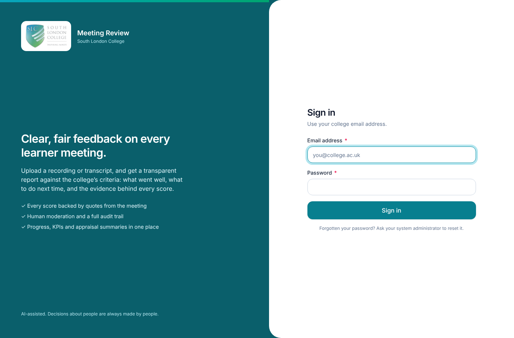
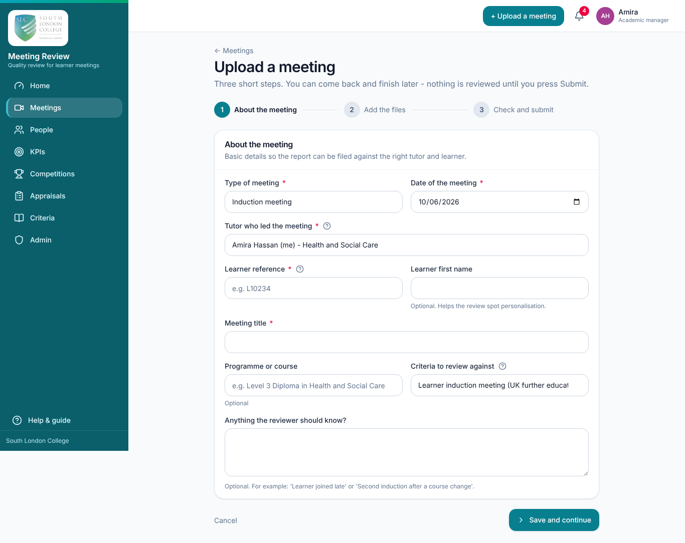
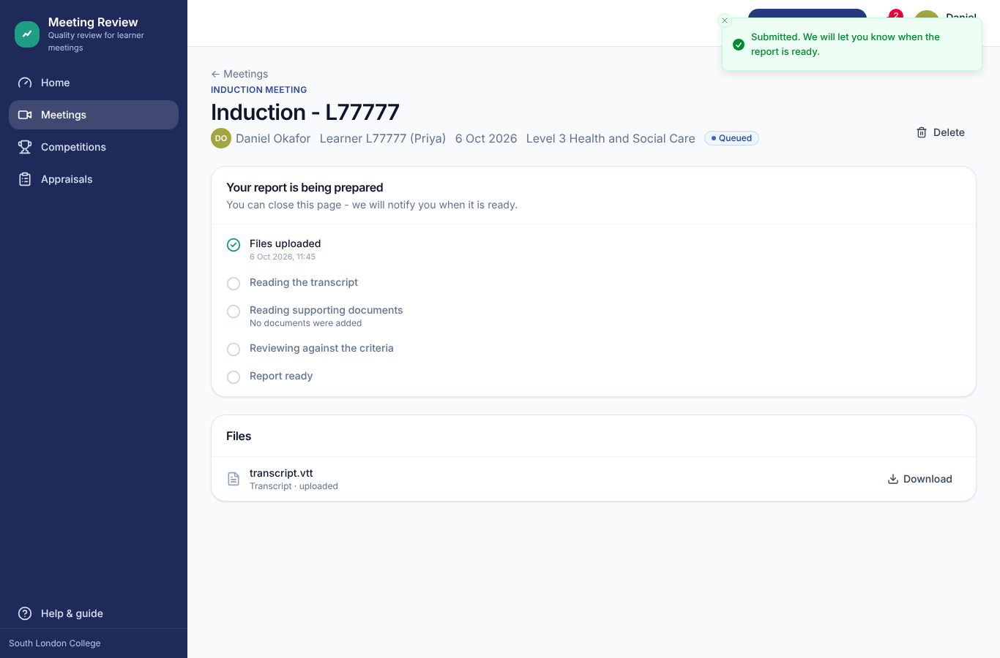
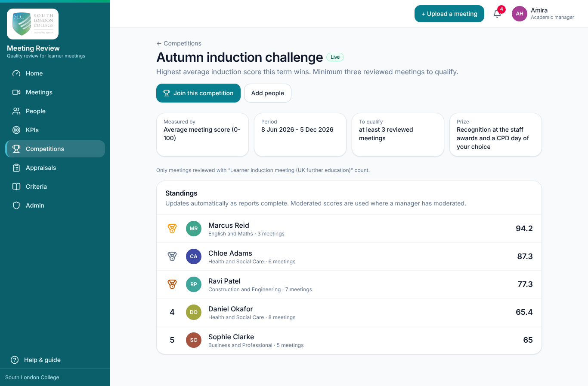
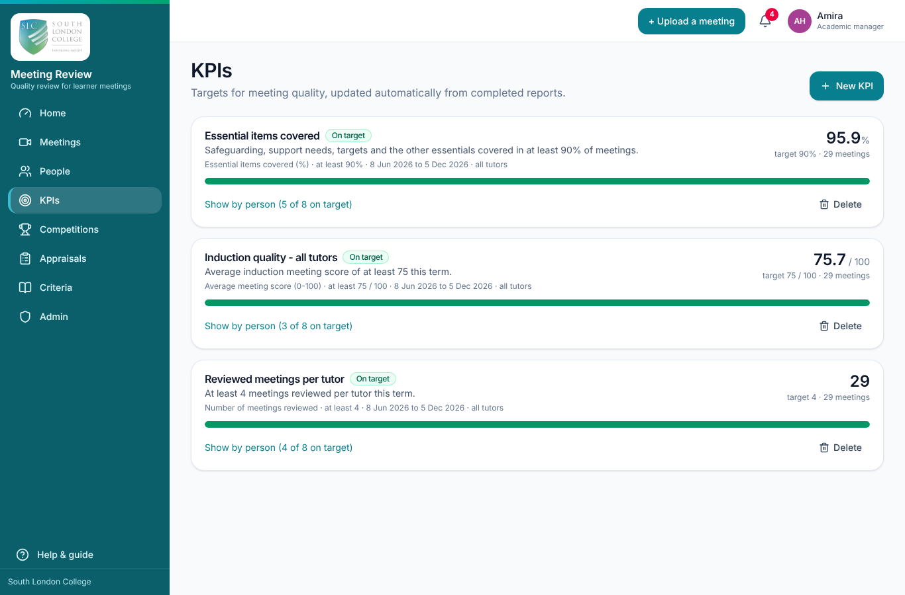
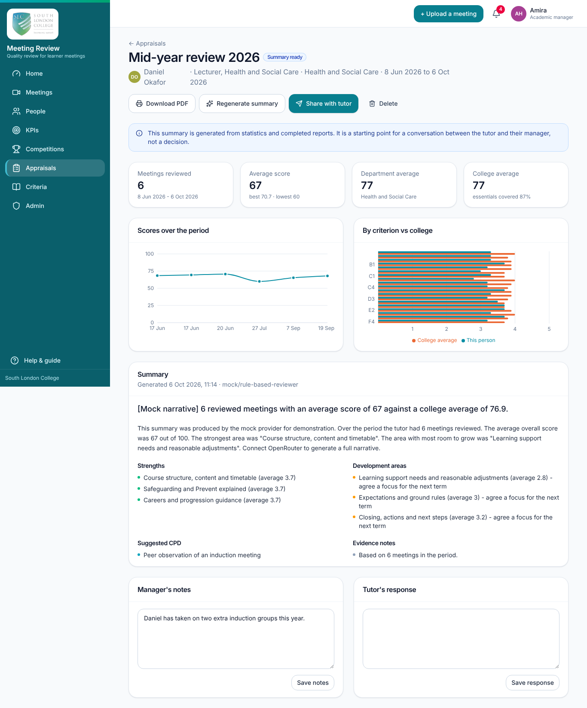

# Meeting Review - user guide

Meeting Review helps South London College give clear, fair feedback on tutor-learner meetings such as inductions. You upload a recording or a transcript of a meeting (and, if you have them, the learner's information booklet and the presentation you used). The system writes up the conversation, reviews what the **tutor** did against the college's criteria, and produces a report with a score, a grade, strengths, things to do next time and the exact quotes each judgement is based on. Academic managers can check and adjust any score, and everything feeds into progress charts, KPIs, competitions and appraisal summaries.

The AI is an assistant, not a judge. Decisions about people are always made by people.

This guide is organised by role. Start with "For everyone", then read the section for your role. Your role is shown under your name in the top-right corner of the screen.

---

## For everyone

### Signing in for the first time

1. A system administrator (or an academic manager or academic admin) invites you. You receive an email headed "You have been invited to Meeting Review" containing a link. If email is not set up at the college, whoever invited you will send you the link another way. The link works for **7 days** and can only be used once.
2. Open the link. The "Set up your account" page shows the email address you were invited with. Check or correct your first and last name, choose a password and confirm it. Passwords must be at least 10 characters and mix lower-case letters with capitals or numbers.
3. Press **Create my account**. You are signed in and taken to your profile.

To sign in later, go to the site address, enter your college email and password and press **Sign in**. If you forget your password, ask your system administrator to reset it: they will give you a temporary password and you will be asked to choose a new one the first time you sign in with it.

To sign out, open the account menu (your name, top right) and choose **Sign out**.

### Your profile

Open the account menu and choose **My profile**. Here you can set:

- your first and last name;
- your **job title** and **department** (please fill these in: reports are grouped and compared by department, and the home page reminds you until they are set);
- a few words about you (shown on your profile page);
- a photo link (optional; otherwise your initials are shown);
- **Email me when a report is ready or someone comments** (you will always see notifications in the app regardless).

Press **Save profile**. **Change password** is also on this page and in the account menu.

### Notifications

The bell icon in the top bar shows how many notifications you have not read. Click it to see the latest ones; clicking a notification opens the relevant page and marks it as read, and **Mark all as read** clears the counter. You are notified when a report is ready, when a review could not be completed, when someone comments on one of your meetings, when a manager moderates your report, when an appraisal is shared with you and when you are entered into a competition. If email is enabled for your account and on the server, the same messages are also emailed.

### Home page

The home page shows how meetings are going over the last 90 days: average score (with the change against the previous 90 days), meetings reviewed, essential items covered, learner talk share (or the number of tutors with reports, for managers), a monthly score trend, how reports were graded, recent meetings, the lowest-scoring criteria ("Where to focus") and the strongest ones ("Going well"). Tutors see their own meetings; managers and above see the whole college and, if they can see people, a by-department table. A "Getting started" card appears until you have completed your profile, uploaded a meeting and read a report.

### Help page

**Help & guide** at the bottom of the left-hand menu repeats the three upload steps and answers the questions staff ask most, including what the grades mean and how the score is worked out.

---

## For tutors

As a tutor you can upload your own meetings, read your own reports, comment on them, take part in competitions and read appraisals that your manager has shared with you.

### Uploading a meeting in three steps

Press **+ Upload a meeting** (top bar) or **Upload a meeting** on the home page or Meetings page. The wizard has three steps; nothing is reviewed until you press Submit, so you can come back and finish later (an unfinished meeting is listed with the status "Draft - not yet submitted").

**Step 1 - About the meeting**

- **Type of meeting**: Induction meeting (the usual choice), Progress review, One-to-one tutorial, Exit interview or Other meeting.
- **Date of the meeting** (cannot be in the future).
- **Learner reference**: the learner's ID from the student record system. The college uses this rather than the learner's full name to keep personal data to a minimum.
- **Learner first name** (optional): helps the review spot personalisation. Administrators can choose to have first names blanked out of transcripts (see Settings).
- **Meeting title**: filled in automatically as "Induction - L12345" once you type the reference; change it if you like.
- **Programme or course** (optional).
- **Criteria to review against**: the set of criteria the meeting is scored against. The default for the meeting type is pre-selected.
- **Anything the reviewer should know?** (optional), for example "Learner joined late".

Press **Save and continue**. The meeting is saved as a draft at this point.

**Step 2 - Add the files**

You must add **either** a recording **or** a transcript (adding one removes the other, so there is a single source of truth for the conversation):

- **Recording of the meeting**: video or audio from Teams, Zoom or a phone. Accepted: `.mp4 .m4a .mp3 .wav .webm .mov .ogg .flac .amr`, up to 4 GB. The system transcribes it for you.
- **Transcript of the meeting**: the `.vtt` or `.docx` transcript that Teams creates, or a `.srt`, `.txt` or Amazon Transcribe `.json` file. Plain-text transcripts work best when each line looks like `[00:12:03] Jane Smith: ...` or `Jane Smith: ...`. If there are no timestamps, timings are estimated.

Optional, but they make the review more personal:

- **Learner information booklet**: the learner's profile or information booklet (`.pdf .docx .txt .md`, up to 50 MB).
- **Presentation used in the meeting**: the slides (`.pptx` or `.pdf`, up to 50 MB).

Drag a file onto the box or click to choose it. A progress bar shows the upload; keep the tab open for large recordings. You can **Replace** or remove a file before submitting. Files are stored securely and are only visible to you and the academic team; recordings are deleted automatically after the retention period set by the college.

Press **Continue**.

**Step 3 - Check and submit**

Check the summary (title, type, date, learner, programme, criteria set, the conversation file and any supporting documents). "What happens next" explains the stages. Press **Submit for review**. You can edit the details afterwards, but the files cannot be changed while the review runs.

### What happens next

The meeting page shows "Your report is being prepared" with a checklist: Files uploaded; Transcribing the recording (or Reading the transcript); Reading supporting documents; Reviewing against the criteria; Report ready. A transcript is usually reviewed in one to three minutes; a recording is transcribed first, which usually takes a few minutes for every ten minutes of audio. You can close the page: you will get a notification when the report is ready.

If something goes wrong the status becomes "Something went wrong" and the page explains why. Press **Try again** to re-run it; if it keeps failing, contact your administrator.

### Finding your meetings

**Meetings** in the left-hand menu lists every meeting you uploaded, with its score, grade, date, length and status. Search by title or learner reference, filter by status and meeting type, and sort by newest, oldest, highest score or lowest score.

### Reading your report

At the top of a finished report:

- **Score ring**: the overall score out of 100. The colour and the label next to it are the **grade** (for the standard bands: Excellent 85+, Good 70+, Developing 55+, Needs support below 55, each with a one-line description). If a manager has moderated the report, a "Moderated" badge shows the original AI score as well.
- A short **summary** of what happened in the meeting.
- **Essential items covered**: how many of the criteria the college marks as essential (for example safeguarding and support needs) scored 3 or more.
- **Learner talk share**: the percentage of the words spoken by the learner, counted directly from the transcript. A higher share usually means a more two-way meeting.
- **Questions the tutor asked**, with how many were open questions (what, how, why, tell me...).
- A **confidence** badge (high, medium or low) with the reason, and the name and version of the criteria set used.

Then:

- **What went well** and **What to do next time**: specific, evidence-based points.
- **Action plan**: small concrete steps for the next meeting, marked high, medium or low priority.
- **From the learner's point of view**: how the meeting probably felt to the learner.
- If the review noticed anything a person should follow up (for example a learner disclosing a wellbeing concern) it appears at the very top under **Things a person should follow up**, with a link to the moment in the transcript.

**Criteria tab.** Every criterion, grouped as in the criteria set, with its score out of 5 (grey means not applicable). Essential criteria are marked **Essential**, and an essential criterion scoring below 3 is outlined in red. Click a criterion to open it: the description of what the reviewer looks for, **Evidence from the meeting** (verbatim quotes with a timestamp button that jumps to that point in the transcript), "What a 4 looks like" (the descriptor for the score given), a practical suggestion, any moderator's note, and the frameworks the criterion draws on.

**Transcript tab.** The full transcript with a timestamp and speaker label on every line. On the right, **Who is who?** lets you correct the speaker labels (Tutor, Learner, Someone else) if the system guessed wrongly. Press **Save speakers** to update the talk-time figures only, or **Save and re-run review** to update them and have the whole review redone. The source of the transcript (Amazon Transcribe, an uploaded transcript, or the sample transcript in a demo system) and the word count are shown underneath.

**How this was scored tab.** The exact arithmetic: overall score = (sum of score x weight) / (sum of 5 x weight) x 100 over the applicable criteria, the essential-items calculation, the grade bands for this criteria set, a table of weights and scores per criterion, the objective measures counted from the transcript (talk shares, questions, longest tutor stretch, speaking pace, turns, words), what the review was based on (which files, which model, prompt and criteria version, token usage, timings), any moderation note, and, when a presentation was uploaded, which slide topics came up. It ends with the limitations: automatic transcription can mis-hear words and names, scores reflect what was said rather than body language, and the model can miss context. Treat the report as a structured second opinion.

**Comments tab.** A conversation thread between you and your manager about this report. Type in the box and press **Post comment**; the other person is notified.

### Other things you can do on a meeting page

- **Download PDF**: opens your browser's print dialogue with a print-friendly version of the report (the Criteria and How-this-was-scored sections are expanded). Choose "Save as PDF" as the printer.
- **Edit**: change the details or files of a meeting that is not currently being processed.
- **Re-run review**: ask for a fresh review of the same transcript, for example after correcting who is who or after the criteria were changed. A re-run produces a new report; any moderation a manager made on the previous report no longer applies to the new one.
- **Delete**: permanently removes the files, transcript and report (you will be asked to confirm). If the meeting counted towards a competition or appraisal, its score will no longer count.
- **Files**: lists what was uploaded with a **Download** button for each (recordings removed under the retention policy are marked as deleted).

### Competitions

**Competitions** lists friendly challenges set up by managers, for example "highest average induction score this term". Each shows what it is measured by, the dates, the minimum number of reviewed meetings needed to qualify, how many people are taking part and whether you are in. Open one and press **Join this competition** (or **Leave**). The **Standings** update automatically as reports complete; you need at least the minimum number of reviewed meetings in the period to be ranked, and the page tells you how many more you need. Managers may also enter you automatically, in which case you are notified.

### Your appraisals

**Appraisals** shows appraisal summaries that your manager has shared with you. Open one to see the statistics for the period (meetings reviewed, your average against the department and college, scores over time, your averages by criterion against the college), the generated summary (headline, overview, strengths, development areas, suggested CPD and evidence notes) and your manager's notes. Under **Tutor's response**, add your own reflections and press **Save response**. Once the appraisal is locked it can no longer be changed. **Download PDF** prints it.

---

## For academic admins

Academic admins can do everything a tutor can, plus upload meetings on behalf of tutors, see and delete any meeting, re-run reviews, see the People page, invite colleagues, and maintain the review criteria.

### Uploading on behalf of a tutor

In step 1 of the upload wizard you have an extra field, **Tutor who led the meeting**. Choose the tutor (choose yourself for your own meetings). The tutor is notified when the report is ready, and you are notified in the app as the uploader. The **Meetings** page shows every meeting in the college, with extra filters by tutor and department.

### Editing criteria sets

**Criteria** in the left-hand menu lists the criteria sets. The college starts with two presets: "South London College online academic induction (Mentor-led, group or one-to-one)" (marked **Preset** and **Default**; the enhanced set described in `induction-criteria-review.md`) and the generic "Learner induction meeting (UK further education)", marked **Preset** only. Each card shows the meeting type it is for, the number of criteria and groups, and the version number.

Good practice is to **Make a copy** of the preset, edit the copy and then make it the default, so the original stays available for reference. You can also edit the preset directly. Editing a set creates a new version; reports already produced keep the version they were scored against, so historical scores never change.

**New criteria set** or **Edit** opens the editor:

- **About this set**: name, **Used for** (meeting type), description, **Default for this meeting type** (pre-selected when staff upload that type of meeting; only one set per type can be default) and **Available for new meetings** (turn off to archive without deleting).
- **Grade bands**: how an overall score out of 100 becomes a grade. Each row has a minimum score, a label and a description; the lowest band always starts at 0. Highest threshold first.
- **Groups of criteria**: each group has a name and a short description. **Add a group of criteria** or **Remove group**.
- **Criteria** within a group. Click a row to open it:
  - **Code** (up to 12 characters, for example B2; must be unique within the set) and **Title**.
  - **Weight**: how much the criterion counts towards the overall score. 1 is normal; 2 counts double; choices are 0.5, 1, 1.5, 2 and 3.
  - **What the reviewer looks for**: a description of the criterion.
  - **Essential item**: must be covered in every meeting. Essential items count towards "essential items covered" and score 1 when they are missing from the meeting (they are never treated as not applicable).
  - **What a 1 / 3 / 5 looks like**: descriptors for the bottom, middle and top of the scale; 2 and 4 are in between.
  - **Framework references**: why the criterion is here (for example "Ofsted Education Inspection Framework - Behaviour and attitudes"). Shown on reports.
  - **Remove criterion**, and **Add a criterion** at the bottom of each group.
- **Save changes** (or **Create**). Every criterion needs a code and a title.
- **Delete**: if any meeting has been reviewed with the set it is archived instead (staff can no longer choose it for new meetings, existing reports are untouched); otherwise it is deleted.

The preset criteria were written with reference to public UK frameworks (Ofsted EIF, ETF Professional Standards 2022, the Matrix Standard, Keeping Children Safe in Education and the Prevent duty, the Equality Act 2010, UK GDPR and DfE apprenticeship funding rules). The references explain why each criterion exists; they are not a claim that any body has endorsed the set, and the quality team should adjust wording, weights and essential flags to the college's expectations.

### Inviting colleagues

Academic admins can invite tutors and other academic admins (see "Inviting users" under system admins for the steps; the Admin page is reached by typing `/admin` in the address bar, as the Admin link is only shown in the menu for managers of users, settings or the audit log).

---

## For academic managers

Academic managers can do everything above, plus moderate reports, manage people and departments, set KPIs, run competitions, write appraisals and export data.

### People and person profiles

**People** lists everyone whose meetings are reviewed (tutors, academic admins and academic managers), with their average score and number of reviewed meetings over the last 12 months and a trend arrow (shown once a person has at least four reviewed meetings: it compares the newer half with the older half). Search by name or email and filter by department. **Export CSV** downloads every completed review (see below).

Click a person for their profile: average score over 12 months against the department and college averages, essential items covered and learner talk share, scores over time, the KPIs that apply to them, their averages by criterion compared with the college, strongest areas and areas to develop, and recent meetings. From here you can **Start an appraisal** or jump to **All meetings** for that person.

### Moderating a report

Open a finished report and press **Moderate scores** (top card). In the dialogue:

1. For any criterion where you disagree with the AI, choose a score from 1 to 5 instead of "Keep AI". The overall score with your changes is previewed at the top.
2. Enter the **Reason for moderation** (required, at least a few words), for example "The tutor did explain Prevent at 12:40 but the transcript mis-heard the word".
3. Press **Save moderation**.

The report then shows the moderated overall score with a "Moderated" badge and the original AI score, each changed criterion is marked "moderated from N", the "How this was scored" tab shows your name, the date and your reason, and the tutor is notified. Moderated scores are the ones used everywhere else: lists, dashboards, KPIs, competitions, appraisals and the CSV export. Your moderation is recorded in the audit log.

### KPIs

**KPIs** shows targets for meeting quality that are updated automatically from completed reports. Press **New KPI**:

- **Name** and **Description**.
- **Measure**: Average meeting score (0-100), Number of meetings reviewed, Essential items covered (%), or Learner talk share (%).
- **Should be** at least / at most, and the **Target**.
- **From** / **To**: the period.
- **Applies to**: all tutors, one department, or one person.

Each KPI card shows the current value, the target, the number of meetings it is based on, a progress bar and a status: **On target**, **Below target** or **No data yet**. For team KPIs, **Show by person** lists every person in scope with their own value and status. Managers can **Delete** a KPI.

### Competitions

**New competition** asks for a name, description and rules, what it is **Measured by** (the same four measures as KPIs), the **Minimum meetings to qualify** (default 3), start and end dates, optionally a **Criteria set** (only meetings reviewed with that set count) and a **Department** (otherwise the whole college), an optional **Prize**, and **Enter everyone automatically**. With automatic entry, every eligible person is entered and notified; otherwise tutors join themselves.

A competition is "Starts soon", "Live" or "Finished" depending on the dates. On its page you can **Add people** by hand. The **Standings** list is ranked by the measure, with medals for the top three; people below the minimum number of reviewed meetings are listed but not ranked. Moderated scores are used where a manager has moderated.

### Appraisals

**Appraisals** lists every appraisal with its status: **Draft**, **Summary ready**, **Shared with tutor** or **Locked**. Press **New appraisal** (or **Start an appraisal** on a person's profile): choose the tutor, give it a title (for example "Mid-year review 2026"), set the period and optionally add **Manager notes** (context the summary should take into account, such as extra responsibilities). The statistics for the period are gathered straight away.

On the appraisal page:

1. **Generate summary** writes the narrative from the statistics and the strengths and improvements recorded on each report in the period (not from the raw transcripts). It takes about a minute; the page updates when it is ready and you are notified. You can **Regenerate summary** after changing your notes. Generation needs at least one completed review in the period.
2. Review and edit **Manager's notes** and press **Save notes**.
3. **Share with tutor** (available once the summary is ready). The tutor is notified, can read everything and add a **Tutor's response**.
4. **Lock** (available once shared) freezes the appraisal; nobody but a manager can change it afterwards, and it can no longer be deleted.
5. **Delete** removes an unlocked appraisal. **Download PDF** prints it.

The page reminds everyone that the summary is a starting point for a conversation between the tutor and their manager, not a decision.

### CSV export

**Export CSV** on the People page downloads `meeting-reviews-<date>.csv` with one row per completed review: meeting id, title, date, tutor id, score, grade, essential items covered (%), learner talk share (%), and one column per criterion code with the 1-5 score (blank where not applicable). Moderated scores are used where they exist. Open it in Excel for appraisal or KPI work. Each export is recorded in the audit log.

---

## For HR and directors

**HR** can see every meeting and report (but not upload, moderate or re-run them), comment on reports, see the People page and profiles, see KPIs and competitions, and manage appraisals in full (create, generate, share, lock and delete), and export the CSV. HR cannot change the criteria or any system settings. The Criteria pages are shown read-only in HR's menu.

**Directors** can see every meeting and report and comment on them, see People and profiles, create and manage KPIs and competitions, read every appraisal (but not create or share them), export the CSV, and read the **Audit log** under **Admin**. Directors cannot upload, moderate, edit criteria or change settings.

Both roles see the college-wide home page.

---

## For system admins

System admins have every permission. **Admin** in the left-hand menu has three tabs.

### Users

- **Invite a colleague**: first name, last name, college email, **Role** (the description of the chosen role appears under the field), department and job title. Press **Send invitation**. The invitation link (valid 7 days) is emailed if email is configured; it is also shown on screen with a **Copy** button so you can send it yourself if not.
- The user table shows each person's role, department and last sign-in. **Show deactivated accounts** includes people who have been switched off.
- **Edit** a user: change their role, department and job title, or switch **Account active** off. Deactivated accounts cannot sign in (any open sessions end) but their reports are kept. You cannot deactivate yourself or change your own role.
- **Reset**: generates a temporary password for the person, shows it to you (and copies it to your clipboard) and emails it to them if email is configured. They must choose a new password when they next sign in.
- **Departments**: add departments here; they are used to group people and compare averages.

Only a system admin can create or edit other system admins. Academic managers and academic admins can invite people too, but only into roles at or below their own level.

### The roles explained

| Role | What it is for |
| --- | --- |
| Tutor | Uploads their own meetings and sees their own reports, progress and appraisals. |
| Academic admin | Uploads meetings on behalf of tutors and maintains the review criteria. |
| Academic manager | Sees every tutor, moderates reports, sets KPIs, runs competitions and writes appraisals. |
| HR | Sees performance summaries and appraisals for people processes. Cannot change criteria. |
| Director | Full read access to all progress, KPIs and reports across the college. |
| System admin | Manages users, settings and integrations. Full access. |

(Note that in the current version directors can also create KPIs and competitions, and HR can create and share appraisals; see the sections above for the exact lists.)

### Settings

- **Connected services**: which file storage, transcription, language-model and email services the server is using. These are set by IT in the server configuration, not here. If "demo mode" is shown against transcription or the language model, reports are being produced by a simple built-in sample reviewer and must not be used for real decisions.
- **General**: the college name shown in reports and prompts; the language-model name and transcription language. At present the model and language actually used come from the server configuration maintained by IT (see docs/architecture.md); the values shown here are stored for information, so ask IT to change the model or language.
- **Data protection**:
  - **Delete recordings after (days)**: recordings are removed automatically after this many days (90 by default; 0 keeps them indefinitely). Transcripts and reports are kept so progress can still be tracked.
  - **Delete transcripts after (days)**: 730 by default; reports are kept.
  - **Redact learner first names from transcripts**: replaces the learner's first name with "[learner]" before the transcript is stored or sent for review.
  - **Tutors can upload their own meetings**: turn off if only academic admins should upload. Tutors then see a message telling them to ask their academic admin.
  - **Email notifications**: the email service must be configured on the server for messages to be sent. Each person can also turn their own emails off in their profile, and that personal choice is what the system currently checks.

Press **Save settings**. Changes are recorded in the audit log.

### Audit log

A record of who did what and when: sign-ins and failed sign-ins, invitations, role changes, password resets, meetings created, submitted, re-run and deleted, files uploaded, removed and downloaded, speaker corrections, comments, completed reviews, moderations, criteria changes, KPIs, competitions, appraisals, settings changes, CSV exports and the nightly retention clean-up. Filter by typing part of an action name, for example `meeting.` or `auth.`.

---

## FAQ

**What do I need to upload?** Either a recording or a transcript of the meeting. The learner booklet and the presentation are optional but improve the review.

**How long does it take?** A transcript: one to three minutes. A recording: a few minutes of transcription for every ten minutes of audio, then the review. You will be notified.

**How is the score worked out?** Each criterion is scored 1 to 5 against written descriptors. Criteria have weights. Overall score = (sum of score x weight) / (sum of 5 x weight) x 100, leaving out criteria marked not applicable. Essential criteria that were not covered score 1. The "How this was scored" tab shows the exact numbers for every report.

**Can the AI be wrong?** Yes. Every score shows the quotes it is based on, each report carries a confidence level, and academic managers can moderate any score with a written reason that is shown on the report and recorded. Transcription can mis-hear words; if a speaker is mislabelled, fix it on the Transcript tab.

**Who can see my reports?** You can see your own. Academic admins, academic managers, HR and directors can see everyone's, according to their role. Downloads, moderations and exports are written to the audit log.

**What happens to the recording?** It is stored securely and deleted automatically after the retention period set by the administrator (90 days by default). Transcripts and reports are kept for longer so progress can be tracked. Learner first names can be redacted.

**Why does my score differ from a colleague's for a similar meeting?** The review only sees what was said. Check the evidence on each criterion, and whether the right speaker was labelled as the tutor. If you still disagree, add a comment for your manager, who can moderate.

**I added a booklet after the report was produced. Will re-running the review use it?** Yes. Add the file on the Edit screen, then press **Re-run review**: new files are read first and the review runs again with them. A new recording or transcript replaces the stored transcript.

**What do the grades mean?** With the standard bands: Excellent (85+) consistently strong practice; Good (70+) secure practice with a small number of improvements; Developing (55+) several areas need attention; Needs support (below 55) significant gaps. Your quality team can rename the bands and change the thresholds in the Criteria screen.

---

## Glossary

- **Criteria set**: the list of criteria (grouped, weighted, with descriptors) that a meeting is scored against. Called a "rubric" in the technical documentation. Each meeting type has a default set.
- **Criterion**: one thing the reviewer looks for, with a code (such as D1), a title, a weight, descriptors for scores 1, 3 and 5, and the framework it draws on.
- **Essential item**: a criterion marked as essential (mandatory) in the criteria set. It must be covered in every meeting, scores 1 when missing, and counts towards "essential items covered", which is the percentage of essential criteria scored 3 or more.
- **Weight**: how much a criterion counts towards the overall score (1 is normal, 2 counts double).
- **Overall score**: the weighted total of criterion scores as a percentage of the maximum possible, 0 to 100.
- **Grade band**: the label a range of overall scores maps to (for example Good, 70 and above). Set per criteria set.
- **Moderation**: an academic manager overriding one or more AI scores with a written reason. The moderated score replaces the AI score everywhere, and both are shown on the report.
- **Learner talk share**: the percentage of the words in the transcript spoken by the learner (tutor and learner words only), counted directly without AI.
- **Confidence**: the reviewer's own estimate (high, medium or low) of how reliable the report is, with the reason, for example a clear two-speaker transcript, or a truncated transcript or a single speaker.
- **Evidence**: verbatim quotes from the transcript, with timestamps, that a score is based on.
- **Speaker map / Who is who**: which raw speaker label in the transcript is the tutor, the learner or someone else. It drives the talk-time figures and can be corrected on the Transcript tab.
- **Action plan**: the small, concrete steps the report suggests for the next meeting.
- **KPI**: a target for a measure (average score, meetings reviewed, essential items covered or learner talk share) over a period, for everyone, a department or one person.
- **Competition**: a friendly challenge ranking participants on one of the same measures over a period, with a minimum number of reviewed meetings to qualify.
- **Appraisal**: an evidence-based summary of a tutor's reviewed meetings over a period, generated for a manager to review, share with the tutor and lock.
- **Audit log**: the system's record of who did what and when.
- **Retention period**: how long recordings (and transcripts) are kept before automatic deletion.
